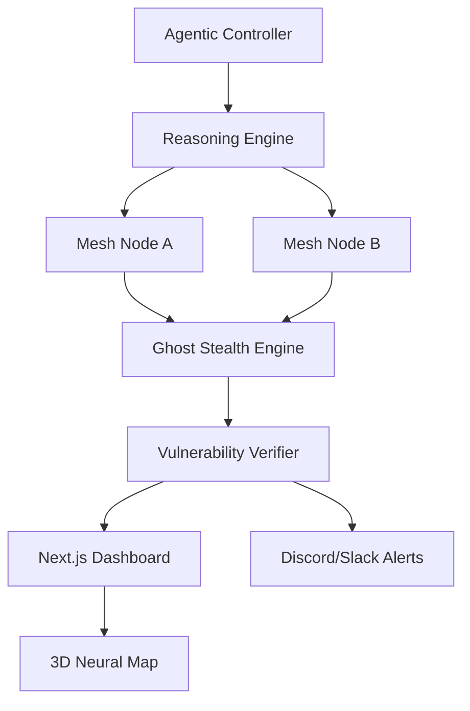

# 🛡️ DARKWIN-NGASR (Next Gen Autonomous Security Researcher)

[](https://github.com/VIPHACKER100/DarkWin-NGASR)
[](https://opensource.org/licenses/MIT)
[](https://www.python.org/downloads/)
[](https://www.kali.org/)

**DARKWIN-NGASR** is a state-of-the-art, autonomous security research ecosystem. It transforms traditional scanning into an agentic reasoning process, capable of self-planning, executing research tasks, verifying vulnerabilities, and providing real-time telemetry across a distributed mesh.

---

## 🌟 Zenith Phase Ecosystem

### 🧠 Autonomous Intelligence
- **Agentic Reasoning Loop**: AI-driven tactical decisions using LLMs.
- **Vulnerability Verification**: Automated false-positive reduction via `VulnVerifier`.
- **`darkwin hunt <target>`**: Fully autonomous research from reconnaissance to verified exploitation.

### 🌐 Distributed Mesh & Stealth
- **Mesh Registry**: Multi-node coordination via Redis.
- **Ghost Mode**: Advanced evasion with randomized fingerprints and Adaptive Jitter.
- **Proxy Rotation**: Automated IP rotation pool to bypass WAFs and IP bans.

### 🎨 Visual & Interactive Telemetry
- **3D Neural Map**: Interactive attack surface visualization in Next.js.
- **Terminal UI (TUI)**: Real-time CLI telemetry dashboard.
- **Interactive Shell (REPL)**: High-fidelity interactive session with auto-completion.

### 🔔 Remote Operations
- **Multichannel Notifications**: Real-time alerts for verified breaches via Discord and Slack.
- **Enterprise Reporting**: AI-synthesized PDF, HTML, and Markdown reports.

---

## 🚀 Getting Started

### 1. Installation
```bash
git clone https://github.com/VIPHACKER100/DarkWin-NGASR.git
cd DarkWin-NGASR
sudo bash setup.sh
```

### 2. Autonomous Launch
```bash
# Enter the interactive shell
python core/darkwin.py shell

# Start a hunt
darkwin > hunt example.com
```

### 3. Orchestration (Docker)
```bash
docker-compose up -d --build
```

---

## 🛠️ CLI Reference

| Command | Description |
|---------|-------------|
| `hunt` | Start an autonomous agentic research loop |
| `shell` | Launch the high-fidelity interactive REPL |
| `mesh` | View and manage distributed scanning nodes |
| `proxy` | View available proxies in the rotation pool |
| `report`| Generate executive AI-synthesized reports |
| `doctor`| Run system diagnostics and self-healing fixes |
| `test`  | Execute core unit tests to verify stability |
| `update`| Pull latest changes and update the ecosystem |
| `update-templates` | Synchronize latest vulnerability templates |
| `about` | Display project branding and author info |

---

## 🏗️ Architecture



---

## 👨‍💻 Author
**ARYAN AHIRWAR (VIPHACKER.100)**
*GitHub: [viphacker100](https://github.com/viphacker100)*

## ⚖️ Disclaimer
This tool is for educational and authorized security research purposes only. The author is not responsible for any misuse or damage caused by this software.
