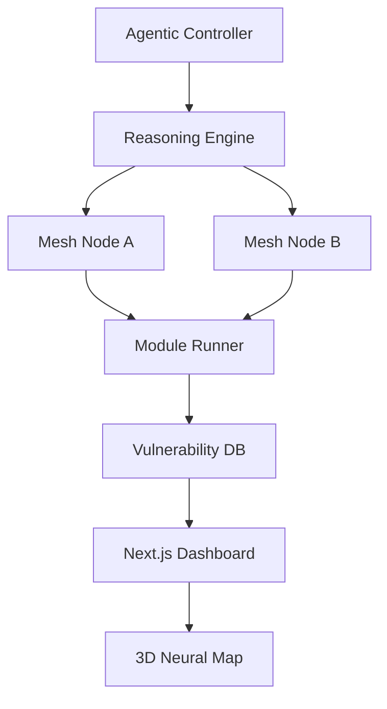

# 🛡️ DARKWIN-NGASR (Next Gen Autonomous Security Researcher)

[](https://opensource.org/licenses/MIT)
[](https://www.python.org/downloads/)
[](https://www.kali.org/)

**DARKWIN-NGASR** is a state-of-the-art, autonomous security research ecosystem designed for proactive reconnaissance and vulnerability intelligence. It transitions traditional scanning into an agentic reasoning process, capable of self-planning and executing research tasks.

---

## 🌟 Zenith Phase Features

### 🤖 Autonomous Intelligence
- **Agentic Reasoning Loop**: AI-driven tactical decisions for module execution.
- **Structured Tactical Planning**: Dynamic research plans generated in real-time.
- **`darkwin hunt <target>`**: Single command for autonomous research.

### 🌐 Global Infrastructure
- **Distributed Mesh Scanning**: Multi-node coordination via Redis registry.
- **Proxy Rotation Pool**: Automated IP rotation to bypass WAF and IP bans.
- **Global Rate Limiter**: Centralized intensity control across the entire mesh.

### 🧠 3D Neural Dashboard
- **Neural Map**: Interactive 3D force-graph visualization of your attack surface.
- **Live Stream Logs**: Real-time WebSocket bridge from scanning engines to UI.
- **Executive AI Reports**: LLM-synthesized risk assessments (PDF/HTML/MD).

### 🕵️ Ghost Mode (Stealth)
- **Advanced Fingerprinting**: Randomized TLS, User-Agents, and HTTP headers.
- **Adaptive Jitter**: Mimics human behavior to avoid behavioral detection.

---

## 🚀 Quick Start

### 1. Requirements
- Python 3.11+
- Redis & PostgreSQL
- Node.js & Docker (for Dashboard & Orchestration)

### 2. Installation
```bash
git clone https://github.com/VIPHACKER100/DarkWin-NGASR.git
cd DarkWin-NGASR
chmod +x setup.sh
./setup.sh
```

### 3. Self-Healing Environment
```bash
python core/darkwin.py doctor --fix
```

### 4. Launching the Ecosystem
```bash
docker-compose up -d --build
```

---

## 🛠️ Usage

### Autonomous Hunt
```bash
python core/darkwin.py hunt example.com --max-steps 10
```

### View Mesh Nodes
```bash
python core/darkwin.py mesh
```

### Generate AI Report
```bash
python core/darkwin.py report <scan_id> --format pdf
```

---

## 🏗️ Architecture



---

## 👨‍💻 Author
**ARYAN AHIRWAR (VIPHACKER.100)**
*GitHub: [viphacker100](https://github.com/viphacker100)*

## ⚖️ Disclaimer
This tool is for educational and authorized security research purposes only. The author is not responsible for any misuse or damage caused by this software.
