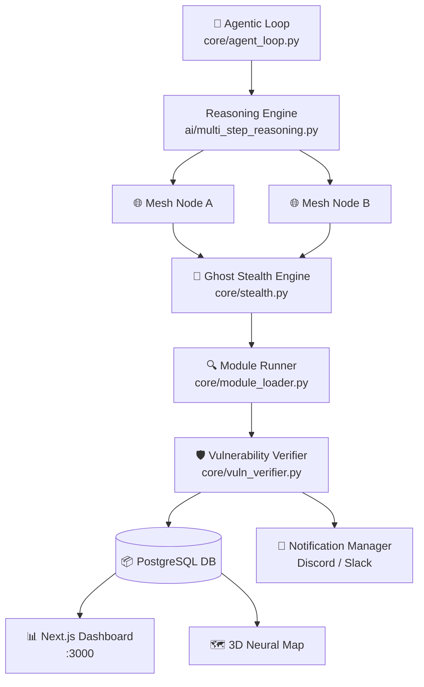

<div align="center">

# 🛡️ DARKWIN-NGASR
### Next Gen Autonomous Security Researcher

[](https://github.com/VIPHACKER100/DarkWin-NGASR)
[](https://python.org)
[](LICENSE)
[](https://kali.org)
[](https://github.com/VIPHACKER100/DarkWin-NGASR/actions)
[](docker-compose.yml)
[](https://visitorbadge.io/status?path=VIPHACKER100.DarkWin-NGASR)

<br/>

> **DARKWIN-NGASR** transforms traditional security scanning into a fully autonomous, agentic research process. It self-plans tactical objectives, executes distributed reconnaissance across a mesh of nodes, verifies vulnerabilities without false positives, and delivers AI-synthesized intelligence reports — all while maintaining ghost-level stealth.

<br/>

```
   ________    ____  _______       _______ _   __
  / ____/ /   / __ // ____/ |     / /  _/ | / /
 / /   / /   / / / / __/  | | /| / // / /  |/ /
/ /___/ /___/ /_/ / /___  | |/ |/ // / / /|  /
\____/_____/\____/_____/  |__/|__/___/_/ |_/

       AUTONOMOUS · DISTRIBUTED · STEALTHY
```

</div>

---

## ⚡ What Makes DARKWIN Different?

| Feature | Traditional Scanners | DARKWIN-NGASR |
|---|---|---|
| **Decision Making** | Static ruleset | AI Reasoning Loop (LLM) |
| **Evasion** | None | Ghost Mode: randomized TLS, UA, Jitter |
| **Scale** | Single node | Distributed Mesh via Redis |
| **Accuracy** | High false-positive rate | Automated Verification Engine |
| **Reporting** | Raw output | AI-synthesized Executive Reports |
| **Interface** | Plain terminal | 3D Neural Map + Live TUI Dashboard |
| **Alerting** | None | Discord & Slack webhooks |

---

## 🌟 Core Feature Set

### 🧠 Autonomous Intelligence
- **Agentic Reasoning Loop** — LLM-powered tactical decision making between each scan step
- **Dynamic Module Selection** — AI chooses the next best tool based on discovered context
- **Self-Terminating** — Stops when no further attack surface is found

### 🌐 Distributed Mesh Infrastructure
- **Multi-node Coordination** via Redis-backed node registry (`mesh_manager.py`)
- **Global Rate Limiter** — Controls scan intensity across the entire mesh
- **Real-time Node Health** — Heartbeat monitoring and auto-deregistration

### 🕵️ Ghost Mode (Stealth Engine)
- **Randomized TLS Fingerprints** — Defeats JA3/JA3S fingerprinting
- **Rotating User-Agents** — Browser-realistic headers on every request
- **Adaptive Jitter** — Human-like delays to avoid behavioral detection
- **Proxy Rotation Pool** — Automated IP rotation to bypass WAF & IP bans

### 🎨 Next.js Dashboard (v2)
- **3D Neural Map** — Interactive ForceGraph attack surface visualization using Three.js
- **Real-time Log Stream** — Socket.io WebSocket bridge from scanner to UI
- **Verified Findings** — Green "Verified" badge for confirmed vulnerabilities
- **AI Report Center** — One-click PDF/HTML/Markdown generation

### 🛡️ Vulnerability Verification Engine
- **Zero False Positives** — Automatically attempts to safely confirm exploitability
- **XSS & SQLi Verification** — Non-destructive payload reflection checks
- **Async Background Processing** — Does not slow down the main scanning loop

### 🔔 Remote Alerting
- **Discord Webhook** — Rich embed notifications with severity colors
- **Slack Webhook** — Instant text-based alerts to your ops channel
- **Lifecycle Events** — Hunt started, critical finding verified, hunt completed

### 🚀 Bug Bounty One-Liner Suite (New)
- **Aggregated Passive Discovery** — Multi-source subdomain and URL extraction (RapidDNS, Archive.org, etc.)
- **Specialized Vuln Modules** — High-fidelity detection for Prototype Pollution, CORS, SSRF, and Subdomain Takeovers
- **JS Intelligence** — Advanced extraction of secrets, API keys, and endpoints from obfuscated scripts
- **Async Execution** — Core scanning engine optimized for massive parallel testing
- **One-Liner Adapter** — Native support for executing complex shell pipelines safely

---

---

## 📖 Documentation

### 👤 User Guides
- **[Getting Started Guide](docs/user/README.md)** — Installation and basic usage.
- **[Command Reference](docs/user/COMMANDS.md)** — Full list of CLI commands and flags.
- **[Advanced Optimization](docs/user/ADVANCED.md)** — Stealth tuning and mesh scaling.
- **[Troubleshooting](docs/user/TROUBLESHOOTING.md)** — Solutions for common issues.
- **[FAQ](docs/user/FAQ.md)** — Frequently Asked Questions.

### 💻 Developer Resources
- **[Architecture Guide](docs/dev/README.md)** — Core engine design and components.
- **[Module Development](docs/dev/MODULES.md)** — How to build custom scan modules.
- **[API Reference](docs/dev/API.md)** — Backend REST API documentation.

### 🏛️ Project Governance
- **[Roadmap](docs/meta/ROADMAP.md)** — Future vision and planned features.
- **[Security Policy](SECURITY.md)** — Vulnerability reporting.
- **[Contributing](CONTRIBUTING.md)** — How to join the project.
- **[Legal Disclaimer](docs/meta/LEGAL.md)** — Usage terms and liability.
- **[Changelog](docs/meta/CHANGELOG.md)** — Version history.
- **[Memory Map](docs/meta/MEMORY_MAP.md)** — Core memory and state management.
- **[Upgrade Fixes](docs/meta/UPGRADES.md)** — Database and environment migration history.

---

## 🚀 Quick Start

### 1. Setup
```bash
git clone https://github.com/VIPHACKER100/DarkWin-NGASR.git
cd DarkWin-NGASR

# Linux/macOS
./setup.sh && source .venv/bin/activate

# Windows (PowerShell)
.\setup.ps1; .\.venv\Scripts\Activate.ps1
```

### 2. Verify
```bash
darkwin doctor --fix
```

### 3. Launch
```bash
# Start an autonomous hunt
darkwin hunt example.com

# Or enter the interactive shell
darkwin shell
```

### 4. Dashboard (Docker)
```bash
docker-compose up -d --build
# Access http://localhost:3000
```

---

## 🛠️ CLI Reference

```
darkwin [COMMAND] [OPTIONS]
```

| Command | Options | Description |
|---|---|---|
| `hunt` | `<target>` `--max-steps N` | Start autonomous AI-driven research loop |
| `shell` | — | Interactive REPL with auto-completion |
| `targets` | `--add` / `--remove` | Add, remove, or list the target scope |
| `history` | `--limit N` | View recent scan history with status |
| `wordlists` | — | Manage and download security wordlists |
| `payloads` | `--type T` | View and manage exploit payloads |
| `screenshots` | `--scan-id ID` | View and manage captured evidence |
| `mesh` | — | View distributed scanning nodes |
| `proxy` | — | View proxy pool |
| `modules` | — | List all available scan modules |
| `report` | `<scan_id>` `--format` | Generate AI-synthesized reports (pdf/html/md) |
| `schedule` | `--add` / `--list` | Manage periodic security scan tasks |
| `logs` | `--tail` / `--search` | View and search system logs |
| `troubleshoot` | — | Interactive guide for common issues |
| `release` | `--changelog` | View version and release history |
| `sysinfo` | — | Display system hardware and OS details |
| `clean` | `--logs` / `--all` | Platform maintenance and data purging |
| `config` | `--view` / `--edit` | View or edit platform configuration |
| `doctor` | `--fix` | System diagnostics + self-healing |
| `test` | — | Run core unit tests |
| `update` | — | Pull latest changes from GitHub |
| `update-templates` | — | Sync latest Nuclei templates |
| `about` | — | Display project branding |

---

## 🏗️ Architecture



### Core Modules

| Module | Location | Purpose |
|---|---|---|
| Agentic Loop | `core/agent_loop.py` | LLM-driven scan orchestration |
| Ghost Mode | `core/stealth.py` | Request evasion & fingerprint randomization |
| Proxy Manager | `core/proxy_manager.py` | IP rotation pool |
| Mesh Manager | `core/mesh_manager.py` | Distributed node registry |
| Vuln Verifier | `core/vuln_verifier.py` | False-positive elimination |
| Cache Manager | `core/cache_manager.py` | Redis-backed scan result caching |
| TUI Engine | `core/tui_engine.py` | Real-time terminal dashboard |
| Notifier | `core/notification_manager.py` | Discord/Slack alerting |
| Reporting | `core/reporting_engine.py` | PDF/HTML/MD export |
| Doctor | `core/doctor.py` | Self-healing diagnostics |

---

## ⚙️ Configuration

Copy the example and edit your API keys:
```bash
cp config.yaml.example config.yaml
nano config.yaml
```

Key settings in `config.yaml`:

```yaml
openai:
  api_key: "sk-..."      # LLM reasoning engine

shodan:
  api_key: "..."         # Passive recon enrichment

notifications:
  discord: "https://discord.com/api/webhooks/..."
  slack:   "https://hooks.slack.com/services/..."
```

---

## 🔧 Troubleshooting

| Error | Cause | Fix |
|---|---|---|
| `ModuleNotFoundError: core.xxx` | Running outside project root | `source .venv/bin/activate` then `darkwin` |
| `ImportError: Sentinel` | System Python shadows `typing_extensions` | `./setup.sh` creates `.venv` to isolate |
| `IndentationError` in command_router | Old cached `.pyc` | `find . -name "*.pyc" -delete && darkwin` |
| `redis.exceptions.ConnectionError` | Redis not running | `docker-compose up -d redis` |
| `darkwin: command not found` | Package not installed | `pip install -e .` inside `.venv` |
| `OperationalError: Authentication failed` | Wrong DB credentials | Align `config.yaml` with `docker-compose.yml` |
| `ModuleNotFoundError: _sqlite3` | Broken Python environment | `sudo apt install libsqlite3-dev` |

Full guide: [TROUBLESHOOTING.md](TROUBLESHOOTING.md)

---

## 📋 Requirements

### System
- Python 3.11+
- Node.js 20+ (dashboard)
- Docker & Docker Compose (orchestration)
- Redis 7+ (mesh / caching / socketio)
- PostgreSQL 15+ (persistent storage)

### Security Tools (optional but recommended)
```bash
# Install via package manager or Go
nmap subfinder httpx nuclei ffuf amass katana sqlmap dalfox masscan gau waybackurls
```

---

## 🤝 Contributing

1. Fork the repository
2. Create a feature branch: `git checkout -b feature/my-module`
3. Commit your changes (use the PR template)
4. Push and open a Pull Request

See [.github/PULL_REQUEST_TEMPLATE.md](.github/PULL_REQUEST_TEMPLATE.md) for contribution guidelines.

---

## 📜 Changelog

See [CHANGELOG.md](CHANGELOG.md) for full version history.

**Latest:** v2.0.0 (Apex) — Stability overhaul, unified versioning, phase-based pipelines, hardened AI reasoning core  
**Previous:** v1.2.0 — Bug Bounty One-Liner Integration, Async Vuln Engines, 10+ New specialized modules  
**Previous:** v1.0.6 — `history` & `targets` CLI commands, CHANGELOG updated  
**Previous:** v1.0.5 — Fixed `IndentationError`, venv-based setup, Pydantic isolation

---

## ⚖️ Legal Disclaimer

> This tool is intended **exclusively** for authorized security research, penetration testing with written permission, and educational purposes. The author, **ARYAN AHIRWAR (VIPHACKER.100)**, is not responsible for any misuse, damage, or illegal activity caused by this software. Always obtain proper authorization before scanning any target.

---

<div align="center">

**Built with ⚡ by [ARYAN AHIRWAR (VIPHACKER.100)](https://github.com/viphacker100)**

*Autonomous · Distributed · Stealthy*


</div>
